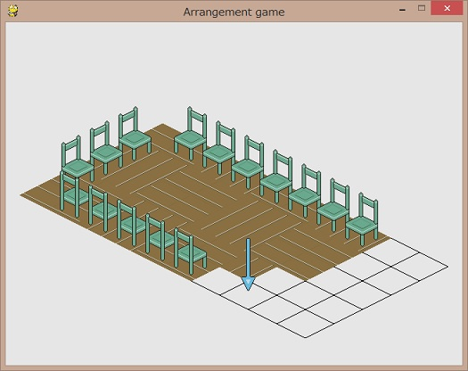

ArrangementGameTry
===

pygameお試し作品。床と椅子を置ける。ディクショナリを使えて喜んでいるのが微笑ましい一品。

## Usage

    KEYS: ACTION
    Z: Put floor
    X: Remove item
    C: Roll item which will be put next time
    A: Put chair
